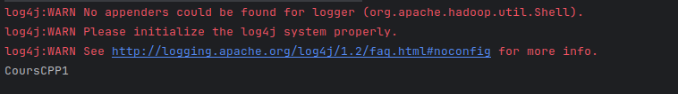

# API Java pour Manipuler le Système de Fichiers Distribué Hadoop (HDFS) (Uder development...🚀)
## Introduuction 
Une API en Java pour interagir avec le Hadoop Distributed File System (HDFS). Cette API offre des fonctionnalités pour la lecture et l'écriture de données dans le HDFS. La première partie du projet se concentre sur l'écriture de données dans un fichier HDFS à l'aide de l'API Java. Dans la deuxième partie, une application est développée pour lire un fichier depuis le HDFS et le réécrire dans le système de fichiers local. Ce référentiel vise à fournir un ensemble d'exemples et de fonctionnalités permettant aux développeurs d'intégrer HDFS dans leurs applications Java.

## Lecture depuis HDFS en Java

### Dépendances Maven
```xml
<dependency>
    <groupId>org.apache.hadoop</groupId>
    <artifactId>hadoop-client</artifactId>
    <version>2.7.3</version>
</dependency>
```

### Code Java
```java
public class Read {
    public static void main() {
        Configuration cf = new Configuration();
        cf.set("fs.defaultFS", "hdfs://localhost:9000");
        FileSystem fileSystem = FileSystem.get(cf);
        Path path = new Path("/BDDC/CPP/Cours/CoursCPP1");
        FSDataInputStream fsdis = fileSystem.open(path);
        BufferedReader reader = new BufferedReader(new InputStreamReader(fsdis, StandardCharsets.UTF_8));
        String ligne = null;
        while ((ligne = reader.readLine()) != null) {
            System.out.println(ligne);
        }
        fsdis.close();
        fileSystem.close();
    }
}
```

### Résultats
